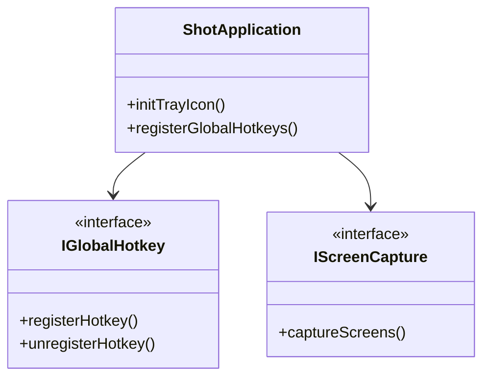

# QShot Architecture

## 模块划分
- **app**: 应用入口、生命周期管理、系统托盘。
- **core**: 核心逻辑，如事件分发、数据模型。
- **capture**: 截图引擎，负责多屏捕获、画面遮罩。
- **overlay**: 悬浮层，用于渲染截图选区和标注。
- **platform**: 平台特定实现抽象（如全局快捷键、自启动）。
- **settings**: 配置管理。

## 平台抽象接口定义
- `IScreenCapture`: 屏幕捕获接口。
- `IGlobalHotkey`: 全局快捷键注册接口。
- `IAutoStart`: 开机自启接口。

## 核心类关系图

